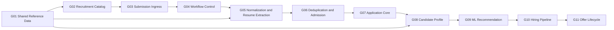

# HireBeat Recruiting D1 v2 Schema

Versioned Cloudflare D1 schema, migration, validation, and GitHub Actions deployment toolkit for HireBeat's real-time recruiting data platform.

中文：HireBeat 实时招聘数据平台的 Cloudflare D1 v2 数据库结构、迁移、验证与自动部署仓库。

## Project status / 项目状态

This repository contains the confirmed schema and the first complete production implementation boundary for HireBeat's real-time recruiting pipeline: authenticated Airtable/Google intake, Queue/DLQ recovery, private R2 PDF preservation, PDF parsing, atomic Raw publication, Outbox dispatch, Workflow A, Workflow B, scheduled reconciliation, ML inference, hiring decision, Offer draft/version/lifecycle commands, and protected Catalog operations.

本仓库包含 HireBeat 新版招聘数据库已经确认的 Schema，以及第一版完整生产实现边界：Airtable/Google 认证接入、Queue/DLQ 自动恢复、私有 R2 PDF 留存、PDF 解析、Raw 原子发布、Outbox、Workflow A、Workflow B、定时 Reconciler、ML 推理、招聘决定、Offer draft/version/lifecycle command 与受保护的 Catalog Operations API。

字段更新后的同步、审计、版本化、重试和历史冻结边界见
`19_data_change_reaction_policy.md`。它覆盖所有 Reference/status 字段家族，并对
Position 提供逐字段反应矩阵。

Current verified baseline:

| Item | Result |
|---|---:|
| Confirmed current tables | 84 |
| Explicit indexes | 120 |
| Confirmed schema groups | 11 |
| Deferred objects | 10 |
| Removed/replaced legacy objects | 22 |
| Local foreign-key violations | 0 |
| Local migration | Passed |

The immutable initial migration creates the original schema objects only. Migrations `0002` through `0014` add R2 file-integrity support, versioned non-secret runtime configuration, reference and hiring-stage seeds, the global ML threshold policy, minimum runtime reference rows, command idempotency, single-promotion protection from normalized Submission to Application, the Active-Position JD invariant, versioned Offer response-deadline policy, a recovery fence for audited Intake replay after technical exhaustion, ordered Catalog snapshot republication, and the UTC-storage / `America/New_York` human-display policy. Deployed migrations are immutable; every later schema or seed change must use a new numbered migration.

## Architecture / 架构



The platform separates:

- authoritative catalog data;
- raw submission evidence;
- workflow, step, attempt, retry, compensation, outbox, and audit control;
- normalized and extracted resume data;
- deduplication evidence and Application admission decisions;
- Person, Application, and Candidate snapshot data;
- candidate education, employment, skills, projects, and identity history;
- anomaly detection, cosine similarity, threshold policy, and ML recommendation;
- hiring stage execution and transitions;
- Offer draft, version, and lifecycle history.

## Raw resume object storage / 原始简历对象存储

A private Cloudflare R2 bucket has been provisioned for original resume PDF files. D1 stores only the corresponding object key, file integrity hash, file metadata, and extracted resume text.

已经为原始简历 PDF 配置了一个私有 Cloudflare R2 Bucket。D1 不保存 PDF BLOB，只保存对应的对象键、文件完整性哈希、文件元数据和解析后的简历文本。

| Item | Value |
|---|---|
| R2 bucket | `hirebeat-hr-raw-resumes-pdf-r2-v1` |
| Worker binding | `hirebeat_hr_raw_resumes_pdf_r2_v1` |
| Storage class | Standard |
| D1 reference table | `raw_submission_resume` |
| D1 object-key column | `resume_r2_object_key` |
| D1 file-hash column | `resume_file_sha256` |
| Current infrastructure status | Bucket created and Wrangler binding configured |
| Current application status | Writing Ingress, Parser, R2, Raw D1 publication, Outbox, Workflow A/B, ML and Operations code implemented and bundle-validated; remote runtime values and Secrets must be configured before deployment |

Responsibility boundary:

- R2 stores the original PDF binary.
- `raw_submission_resume.resume_r2_object_key` identifies the corresponding R2 object.
- `raw_submission_resume.resume_file_sha256` verifies original-file integrity.
- `raw_submission_resume.resume_text` stores extracted UTF-8 text when parsing succeeds.
- R2 object bytes are not duplicated into D1.
- The bucket remains private; resumes must not be exposed through a public bucket URL.
- The R2 service uses `raw-resumes/v1/{submission_uuid}/{resume_file_sha256}.pdf`, conditional create semantics, and metadata verification on technical redelivery.
- `workers/submission-ingress/` connects the canonical intake contract, Airtable/Google adapters, bounded PDF acquisition, Google service-account Drive authentication, SHA-256, conditional R2 storage, authenticated Parser call, D1 intake fencing, atomic Raw/Resume/Outbox publication, and retry/terminal-failure accounting.

## Confirmed schema groups / 已确认分组

| Group | Scope | Tables |
|---|---|---:|
| G01 | Shared reference and talent taxonomy | 21 |
| G02 | Recruitment catalog and form-option synchronization | 11 |
| G03 | Submission ingress, raw submission, and raw resume | 3 |
| G04 | Versioned configuration, workflow, step, attempt, outbox, and audit control | 7 |
| G05 | Normalization and structured resume extraction | 8 |
| G06 | Deduplication and Application admission | 3 |
| G07 | Person, Application, Candidate core, and lineage | 7 |
| G08 | Candidate and Person profile facts | 11 |
| G09 | Real-time ML analysis and recommendation | 5 |
| G10 | Hiring pipeline and actual stage execution | 5 |
| G11 | Offer lifecycle | 3 |
| **Total** | **Current production schema** | **84** |

Detailed group responsibilities and decisions are documented in [`00_master_table_groups.md`](00_master_table_groups.md). The table-level inventory is available in [`00_master_table_inventory.csv`](00_master_table_inventory.csv).

The protected Operations API now provides whitelist-based production importers
for all 21 G01 Reference types and all six writable G02 Catalog child types.
Rows that contain `is_active` default to active unless the authoring request
explicitly supplies `false` or `0`. A Position with a ready JD defaults to
`active`; a Position without a ready JD defaults to `draft`.

## Core design principles / 核心原则

- All table and column names use `lower_snake_case`.
- D1/SQLite foreign keys and explicit `ON DELETE` behavior protect same-layer ownership.
- Cross-layer Submission-to-Application traceability uses dedicated lineage instead of coupling the Application runtime directly to Submission tables.
- Every production step is designed to become self-contained and idempotent.
- Short D1 transactions provide database atomicity; workflow compensation handles cross-step business rollback.
- Raw source evidence, workflow state, technical errors, and audit history are not silently overwritten.
- Optional child entities are represented by zero rows or `NULL`, never fake `unknown` or placeholder entities.
- Zero Education, Employment, Skill or Project rows do not independently reject
  an Application in ML v1; the frozen similarity input remains full Resume text
  plus Position JD.
- Shared entities such as Company, Position, Skill, School, and Person are not deleted by a failed application workflow.
- Reliable asynchronous handoffs use the Outbox pattern. SQL triggers are not used for workflow orchestration; the narrow Position trigger only protects the local invariant that an Active Position must have a usable JD.
- Automatic recovery uses the owning platform primitive: Queue/DLQ for Intake delivery, Workflows for step retries, Outbox leases for committed handoffs, scheduled reconciliation for durable business waits/deadlines, and decision fences for stale-work cancellation. See [`18_automatic_recovery_policy.md`](18_automatic_recovery_policy.md).
- Destructive cleanup is never part of automatic migrations or GitHub Actions.

## Repository structure / 仓库结构

```text
.
├── .github/workflows/deploy-d1.yml
├── migrations/
│   ├── 0001_initial_schema.sql
│   ├── 0002_add_resume_file_integrity.sql
│   ├── 0003_add_versioned_system_configuration.sql
│   ├── 0004_seed_pipeline_and_ml_reference_bands.sql
│   ├── 0005_freeze_intake_resume_file_hash.sql
│   ├── 0006_seed_global_ml_threshold_policy.sql
│   ├── 0007_seed_minimum_runtime_reference_data.sql
│   ├── 0008_enforce_command_idempotency.sql
│   ├── 0009_enforce_single_application_promotion.sql
│   └── 0010_require_jd_for_active_position.sql
├── workers/
│   ├── submission-ingress/
│   ├── etl-orchestrator/
│   └── operations-api/
├── services/
│   ├── resume-parser/
│   └── ml-inference/
├── test-exports/
│   └── read-only inspection export contract
├── schema/
│   ├── HIREBEAT_D1_CREATE_2026-08-17.sql
│   ├── HIREBEAT_D1_DELETE_ALL_2026-08-17.sql
│   ├── HIREBEAT_D1_CONSTRAINT_DEFAULT_MATRIX.csv
│   ├── HIREBEAT_D1_CONSTRAINT_DEFAULT_MATRIX.md
│   ├── HIREBEAT_D1_MANUAL_INSERT_TEMPLATES.sql
│   └── status_field_policy.csv
├── scripts/
│   ├── build_schema_artifacts.py
│   ├── generate_constraint_matrix.py
│   └── validate_schema.py
├── shared_reference/ through offer/
│   └── confirmed group design and source SQL
├── 15_production_implementation_runbook.md
├── 16_runtime_three_way_comparison.md
├── 17_staging_end_to_end_acceptance_plan.md
├── 18_automatic_recovery_policy.md
├── wrangler.toml
├── package.json
├── DEPLOYMENT_GUIDE.md
└── README.md
```

The canonical database deployment entry point is the ordered set of files in `migrations/`. The canonical runtime entry points are the three packages below `workers/`; the former root JavaScript Ingress prototype and its standalone Wrangler config were removed to prevent accidental deployment. The standalone CREATE file represents the latest complete schema for a fresh database and is therefore no longer byte-identical to `0001`. The DELETE file is a separate manual emergency/testing utility and is intentionally excluded from `migrations/`.

The generated constraint/default matrix covers every column in all 84 current
tables. `status_field_policy.csv` is the reviewed source of truth for every
`status`, `*_status`, and `is_active` field. Validation fails if a new status field has no
policy, a policy becomes stale, a protected default/nullability changes, or an
unreviewed SQL Trigger appears. Manual SQL is an administrative exception and
must begin from `HIREBEAT_D1_MANUAL_INSERT_TEMPLATES.sql`; production writes
should continue to use the protected importers so callers receive friendly
field-specific validation errors.

## Prerequisites / 环境要求

- Node.js and npm
- Python 3
- A Cloudflare account with D1 access
- A private Cloudflare R2 bucket for original resume PDFs
- Wrangler authentication for local administration
- A GitHub repository for automated remote deployment

Install project dependencies:

```bash
npm install
```

## Build and validate / 构建与验证

Regenerate the deployable SQL artifacts from the 11 confirmed group modules:

```bash
npm run schema:build
```

Validate the initial migration in an in-memory SQLite database:

```bash
npm run schema:validate
```

`schema:build` also regenerates the 84-table constraint/default documentation
and manual INSERT templates from the fully migrated schema. These generated
files must be committed together with any migration or group-schema change.

Validate the authenticated PDF Parser contract in an isolated Python environment:

```bash
python3 -m pip install -r services/resume-parser/requirements-dev.txt
PYTHONPATH=services/resume-parser python3 -m pytest -q services/resume-parser/test
```

Expected result:

```text
Schema validation succeeded: 14 migrations, 84 tables, 120 explicit indexes, 56 status policies, 4 reviewed cross-column triggers, 0 FK violations.
```

## Configure Cloudflare D1 / 配置数据库

Create a new D1 database:

```bash
npx wrangler login
npx wrangler d1 create hirebeat_recruiting_d1_v2
```

Update `wrangler.toml` with the returned database name and UUID:

```toml
[[d1_databases]]
binding = "DB"
database_name = "hirebeat_recruiting_d1_v2"
database_id = "YOUR_D1_DATABASE_UUID"
migrations_dir = "migrations"
migrations_table = "d1_migrations"
```

The D1 database UUID is an identifier, not an authentication secret. Cloudflare API tokens, service-account files, `.env`, and `.dev.vars` files must never be committed.

## Local D1 test / 本地测试

List and apply the migration to the local D1 instance:

```bash
npm run d1:migrations:list:local
npm run d1:migrations:apply:local
```

Verify the business-table count:

```bash
npx wrangler d1 execute DB --local --command \
  "SELECT COUNT(*) AS business_table_count
   FROM sqlite_master
   WHERE type = 'table'
     AND name NOT LIKE 'sqlite_%'
     AND name <> 'd1_migrations'
     AND substr(name, 1, 4) <> '_cf_';"
```

Verify foreign keys:

```bash
npx wrangler d1 execute DB --local --command \
  "PRAGMA foreign_key_check;"
```

The expected table count is `84`; a successful foreign-key check returns no violation rows.

## GitHub Actions deployment / 自动部署

The workflow in `.github/workflows/deploy-d1.yml` runs when migration or deployment files are pushed to `main`, or when manually started with `workflow_dispatch`.

It performs the following steps:

1. checks out the repository;
2. validates the generated schema and `wrangler.toml`;
3. authenticates using GitHub Actions secrets;
4. runs `wrangler d1 migrations apply DB --remote`.

Required repository secrets:

| Secret | Purpose |
|---|---|
| `CLOUDFLARE_API_TOKEN` | Cloudflare token scoped to the target account with D1 Edit access |
| `CLOUDFLARE_ACCOUNT_ID` | Account containing the target D1 database |

D1 records applied migrations in `d1_migrations`. Pushing the same repository again does not recreate the schema.

## Remote verification / 远程验证

```bash
npm run d1:migrations:list:remote
```

```bash
npx wrangler d1 execute DB --remote --command \
  "PRAGMA foreign_key_check;"
```

The currently configured remote D1/R2 resources are the staging environment. Staging deployment should
occur through GitHub Actions. After end-to-end validation, production must use separate D1/R2/Worker/
Workflow resources and a protected GitHub `production` Environment with approval. Direct remote commands
should be reserved for controlled verification or explicitly approved administrative operations.

Production-grade describes the code, contracts, tests, observability, and recovery behavior; it does not
mean testing directly against live candidate data. Local, staging, and production run the same release
artifacts with isolated bindings and Secrets.

## Migration policy / 迁移规范

After `0001_initial_schema.sql` has been applied, do not edit it in place. Create a new migration for every schema change:

```bash
npx wrangler d1 migrations create DB "describe_the_change"
```

Future files should follow sequential naming such as:

```text
0002_reference_seed.sql
0003_hiring_pipeline_stage_seed.sql
0004_add_example_field.sql
```

Each migration must be tested locally before being pushed to `main`.

## Destructive reset warning / 清库警告

`schema/HIREBEAT_D1_DELETE_ALL_2026-08-17.sql` permanently drops all 84 HireBeat business tables and their data. It does not drop `d1_migrations` or Cloudflare internal tables.

Never place this file in `migrations/`, never execute it from automatic CI/CD, and never run it against production without an approved backup and recovery plan. For a completely clean development reset, creating a new disposable D1 database is safer than reusing a migration-managed database after manual table deletion.

## Security and repository visibility / 安全与可见性

This repository must contain schema, migration, and documentation artifacts only. It must not contain:

- applicant resumes or personally identifiable information;
- Airtable tokens;
- Google service-account credentials;
- Cloudflare API tokens or Global API Keys;
- exported production data;
- `.env`, `.dev.vars`, local D1 state, or runtime caches.

If this repository is made public, confirm that HireBeat has authorized publication of its internal database architecture and workflow rules. Otherwise, keep the repository private.

On-demand inspection CSVs use the fixed workspace directory [`test-exports/`](test-exports/README.md).
Generated rows are ignored by Git because they can contain candidate PII. Team sharing uses a private,
time-limited GitHub Actions Artifact; only the directory contract, manifest schema, and synthetic or
explicitly redacted samples may be committed.

## Remaining deployment prerequisites and deferred work / 尚待外部配置与后续增强

- Configure private Parser and ML service URLs, authentication Secrets, Cloudflare Access team domain/AUD, and source credentials before remote Worker deployment.
- Connect each native Airtable Automation / Google Apps Script producer to its authenticated Ingress route.
- Implement provider-specific Catalog option writers after the exact Airtable base and Google Form IDs are available; D1 Catalog revision publication is implemented.
- Run staging end-to-end tests for empty database, first submission, technical redelivery, intentional resubmission, supersession fence, rejection, Offer creation/versioning, and terminal recovery before creating isolated production resources.
- ML model/version expansion, chunked long-text embedding, Position-level work mode, reference-data releases, and external Offer document/e-signature integration remain deliberately deferred.

See [`03_future_optimization_recommendations.md`](03_future_optimization_recommendations.md) for the maintained optimization backlog.

## Documentation / 文档索引

- [`DEPLOYMENT_GUIDE.md`](DEPLOYMENT_GUIDE.md): local Git, GitHub, Wrangler, and D1 deployment guide
- [`00_master_table_groups.md`](00_master_table_groups.md): complete group definitions
- [`00_master_table_inventory.csv`](00_master_table_inventory.csv): all initial, deferred, and removed objects
- [`01_global_schema_conventions.md`](01_global_schema_conventions.md): global naming, key, FK, state, and lifecycle rules
- [`02_three_way_schema_comparison.csv`](02_three_way_schema_comparison.csv): new schema vs. legacy schema vs. teammate implementation
- [`12_deferred_and_removed_review.md`](12_deferred_and_removed_review.md): deferred and removed object decisions
- [`13_full_group_confirmation_and_audit.md`](13_full_group_confirmation_and_audit.md): final confirmation and structural audit
- [`14_remaining_production_decisions.md`](14_remaining_production_decisions.md): frozen D01-D15 production decisions
- [`15_production_implementation_runbook.md`](15_production_implementation_runbook.md): implemented runtime flow, APIs, required bindings/Secrets, validation and deployment gates
- [`16_runtime_three_way_comparison.md`](16_runtime_three_way_comparison.md): runtime-level differences from the legacy Colab flow and teammate Worker
- [`test-exports/README.md`](test-exports/README.md): centralized inspection-export directory and PII boundary

## License

No open-source license is included. Unless the repository owner adds a license, all rights are reserved and the contents may not be reused or redistributed without permission.
