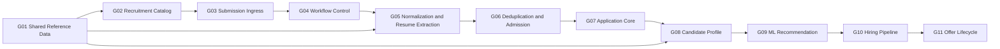

# HireBeat Recruiting D1 v2 Schema

Versioned Cloudflare D1 schema, migration, validation, and GitHub Actions deployment toolkit for HireBeat's real-time recruiting data platform.

中文：HireBeat 实时招聘数据平台的 Cloudflare D1 v2 数据库结构、迁移、验证与自动部署仓库。

## Project status / 项目状态

This repository contains the **confirmed initial schema foundation** for the new HireBeat recruiting database. The schema has been generated and validated locally, but the production ETL and Workflow A/B implementation is intentionally developed in later stages.

本仓库包含 HireBeat 新版招聘数据库已经确认的首版 Schema 基础。数据库结构已经完成本地生成和验证，但生产级 Ingress、Workflow A/B、Catalog Sync 与 Offer command 的具体实现将在后续阶段继续开发。

Current verified baseline:

| Item | Result |
|---|---:|
| Confirmed current tables | 84 |
| Explicit indexes | 118 |
| Confirmed schema groups | 11 |
| Deferred objects | 10 |
| Removed/replaced legacy objects | 22 |
| Local foreign-key violations | 0 |
| Local migration | Passed |

The immutable initial migration creates schema objects only. Migration `0003` adds the versioned non-secret system-configuration tables and their initial bootstrap release. Reference seeds and the 13 hiring pipeline stage seeds are still managed separately through later versioned migrations.

## Architecture / 架构



The platform separates:

- authoritative catalog data;
- raw submission evidence;
- workflow, step, attempt, retry, compensation, outbox, and audit control;
- normalized and extracted resume data;
- deduplication evidence and Application admission decisions;
- Person, Application, and Candidate snapshot data;
- candidate education, employment, skills, projects, and identity history;
- anomaly detection, cosine similarity, threshold policy, and ML recommendation;
- hiring stage execution and transitions;
- Offer draft, version, and lifecycle history.

## Raw resume object storage / 原始简历对象存储

A private Cloudflare R2 bucket has been provisioned for original resume PDF files. D1 stores only the corresponding object key, file integrity hash, file metadata, and extracted resume text.

已经为原始简历 PDF 配置了一个私有 Cloudflare R2 Bucket。D1 不保存 PDF BLOB，只保存对应的对象键、文件完整性哈希、文件元数据和解析后的简历文本。

| Item | Value |
|---|---|
| R2 bucket | `hirebeat-hr-raw-resumes-pdf-r2-v1` |
| Worker binding | `hirebeat_hr_raw_resumes_pdf_r2_v1` |
| Storage class | Standard |
| D1 reference table | `raw_submission_resume` |
| D1 object-key column | `resume_r2_object_key` |
| D1 file-hash column | `resume_file_sha256` |
| Current infrastructure status | Bucket created and Wrangler binding configured |
| Current application status | PDF upload and parsing Worker not yet implemented |

Responsibility boundary:

- R2 stores the original PDF binary.
- `raw_submission_resume.resume_r2_object_key` identifies the corresponding R2 object.
- `raw_submission_resume.resume_file_sha256` verifies original-file integrity.
- `raw_submission_resume.resume_text` stores extracted UTF-8 text when parsing succeeds.
- R2 object bytes are not duplicated into D1.
- The bucket remains private; resumes must not be exposed through a public bucket URL.
- The upcoming production Ingress adapter will idempotently upload the PDF to R2 first, then use a short D1 transaction to publish the Raw metadata, intake status, and Workflow A Outbox event.

## Confirmed schema groups / 已确认分组

| Group | Scope | Tables |
|---|---|---:|
| G01 | Shared reference and talent taxonomy | 21 |
| G02 | Recruitment catalog and form-option synchronization | 11 |
| G03 | Submission ingress, raw submission, and raw resume | 3 |
| G04 | Versioned configuration, workflow, step, attempt, outbox, and audit control | 7 |
| G05 | Normalization and structured resume extraction | 8 |
| G06 | Deduplication and Application admission | 3 |
| G07 | Person, Application, Candidate core, and lineage | 7 |
| G08 | Candidate and Person profile facts | 11 |
| G09 | Real-time ML analysis and recommendation | 5 |
| G10 | Hiring pipeline and actual stage execution | 5 |
| G11 | Offer lifecycle | 3 |
| **Total** | **Current production schema** | **84** |

Detailed group responsibilities and decisions are documented in [`00_master_table_groups.md`](00_master_table_groups.md). The table-level inventory is available in [`00_master_table_inventory.csv`](00_master_table_inventory.csv).

## Core design principles / 核心原则

- All table and column names use `lower_snake_case`.
- D1/SQLite foreign keys and explicit `ON DELETE` behavior protect same-layer ownership.
- Cross-layer Submission-to-Application traceability uses dedicated lineage instead of coupling the Application runtime directly to Submission tables.
- Every production step is designed to become self-contained and idempotent.
- Short D1 transactions provide database atomicity; workflow compensation handles cross-step business rollback.
- Raw source evidence, workflow state, technical errors, and audit history are not silently overwritten.
- Optional child entities are represented by zero rows or `NULL`, never fake `unknown` or placeholder entities.
- Shared entities such as Company, Position, Skill, School, and Person are not deleted by a failed application workflow.
- SQL triggers are not used in the initial version; reliable asynchronous handoffs use the Outbox pattern.
- Destructive cleanup is never part of automatic migrations or GitHub Actions.

## Repository structure / 仓库结构

```text
.
├── .github/workflows/deploy-d1.yml
├── migrations/
│   ├── 0001_initial_schema.sql
│   ├── 0002_add_resume_file_integrity.sql
│   └── 0003_add_versioned_system_configuration.sql
├── schema/
│   ├── HIREBEAT_D1_CREATE_2026-08-17.sql
│   └── HIREBEAT_D1_DELETE_ALL_2026-08-17.sql
├── scripts/
│   ├── build_schema_artifacts.py
│   └── validate_schema.py
├── shared_reference/ through offer/
│   └── confirmed group design and source SQL
├── wrangler.toml
├── package.json
├── DEPLOYMENT_GUIDE.md
└── README.md
```

The canonical deployment entry point is the ordered set of files in `migrations/`. `0001_initial_schema.sql` is the immutable deployed baseline; every later change is added as a new migration. The standalone CREATE file represents the latest complete schema for a fresh database and is therefore no longer byte-identical to `0001`. The DELETE file is a separate manual emergency/testing utility and is intentionally excluded from `migrations/`.

## Prerequisites / 环境要求

- Node.js and npm
- Python 3
- A Cloudflare account with D1 access
- A private Cloudflare R2 bucket for original resume PDFs
- Wrangler authentication for local administration
- A GitHub repository for automated remote deployment

Install project dependencies:

```bash
npm install
```

## Build and validate / 构建与验证

Regenerate the deployable SQL artifacts from the 11 confirmed group modules:

```bash
npm run schema:build
```

Validate the initial migration in an in-memory SQLite database:

```bash
npm run schema:validate
```

Expected result:

```text
Schema validation succeeded: 3 migrations, 84 tables, 118 explicit indexes, 0 FK violations.
```

## Configure Cloudflare D1 / 配置数据库

Create a new D1 database:

```bash
npx wrangler login
npx wrangler d1 create hirebeat_recruiting_d1_v2
```

Update `wrangler.toml` with the returned database name and UUID:

```toml
[[d1_databases]]
binding = "DB"
database_name = "hirebeat_recruiting_d1_v2"
database_id = "YOUR_D1_DATABASE_UUID"
migrations_dir = "migrations"
migrations_table = "d1_migrations"
```

The D1 database UUID is an identifier, not an authentication secret. Cloudflare API tokens, service-account files, `.env`, and `.dev.vars` files must never be committed.

## Local D1 test / 本地测试

List and apply the migration to the local D1 instance:

```bash
npm run d1:migrations:list:local
npm run d1:migrations:apply:local
```

Verify the business-table count:

```bash
npx wrangler d1 execute DB --local --command \
  "SELECT COUNT(*) AS business_table_count
   FROM sqlite_master
   WHERE type = 'table'
     AND name NOT LIKE 'sqlite_%'
     AND name <> 'd1_migrations'
     AND substr(name, 1, 4) <> '_cf_';"
```

Verify foreign keys:

```bash
npx wrangler d1 execute DB --local --command \
  "PRAGMA foreign_key_check;"
```

The expected table count is `84`; a successful foreign-key check returns no violation rows.

## GitHub Actions deployment / 自动部署

The workflow in `.github/workflows/deploy-d1.yml` runs when migration or deployment files are pushed to `main`, or when manually started with `workflow_dispatch`.

It performs the following steps:

1. checks out the repository;
2. validates the generated schema and `wrangler.toml`;
3. authenticates using GitHub Actions secrets;
4. runs `wrangler d1 migrations apply DB --remote`.

Required repository secrets:

| Secret | Purpose |
|---|---|
| `CLOUDFLARE_API_TOKEN` | Cloudflare token scoped to the target account with D1 Edit access |
| `CLOUDFLARE_ACCOUNT_ID` | Account containing the target D1 database |

D1 records applied migrations in `d1_migrations`. Pushing the same repository again does not recreate the schema.

## Remote verification / 远程验证

```bash
npm run d1:migrations:list:remote
```

```bash
npx wrangler d1 execute DB --remote --command \
  "PRAGMA foreign_key_check;"
```

Remote production deployment should occur through GitHub Actions. Direct remote commands should be reserved for controlled verification or explicitly approved administrative operations.

## Migration policy / 迁移规范

After `0001_initial_schema.sql` has been applied, do not edit it in place. Create a new migration for every schema change:

```bash
npx wrangler d1 migrations create DB "describe_the_change"
```

Future files should follow sequential naming such as:

```text
0002_reference_seed.sql
0003_hiring_pipeline_stage_seed.sql
0004_add_example_field.sql
```

Each migration must be tested locally before being pushed to `main`.

## Destructive reset warning / 清库警告

`schema/HIREBEAT_D1_DELETE_ALL_2026-08-17.sql` permanently drops all 84 HireBeat business tables and their data. It does not drop `d1_migrations` or Cloudflare internal tables.

Never place this file in `migrations/`, never execute it from automatic CI/CD, and never run it against production without an approved backup and recovery plan. For a completely clean development reset, creating a new disposable D1 database is safer than reusing a migration-managed database after manual table deletion.

## Security and repository visibility / 安全与可见性

This repository must contain schema, migration, and documentation artifacts only. It must not contain:

- applicant resumes or personally identifiable information;
- Airtable tokens;
- Google service-account credentials;
- Cloudflare API tokens or Global API Keys;
- exported production data;
- `.env`, `.dev.vars`, local D1 state, or runtime caches.

If this repository is made public, confirm that HireBeat has authorized publication of its internal database architecture and workflow rules. Otherwise, keep the repository private.

## Known deferred work / 后续工作

- Reference and hiring-stage seed migrations
- Production Ingress adapters for Airtable and Google Forms
- Workflow A and Workflow B implementation
- Table-level idempotency, retry, terminal-failure, and compensation tests
- Catalog synchronization execution logic
- ML model/version expansion beyond the initial production model
- Candidate/JD chunked embedding to avoid long-text truncation
- Optional Position-level work mode
- Offer approval and more advanced Offer versioning integrations
- End-to-end empty database, first submission, duplicate delivery, resubmission, supersession, rejection, and Offer tests

See [`03_future_optimization_recommendations.md`](03_future_optimization_recommendations.md) for the maintained optimization backlog.

## Documentation / 文档索引

- [`DEPLOYMENT_GUIDE.md`](DEPLOYMENT_GUIDE.md): local Git, GitHub, Wrangler, and D1 deployment guide
- [`00_master_table_groups.md`](00_master_table_groups.md): complete group definitions
- [`00_master_table_inventory.csv`](00_master_table_inventory.csv): all initial, deferred, and removed objects
- [`01_global_schema_conventions.md`](01_global_schema_conventions.md): global naming, key, FK, state, and lifecycle rules
- [`02_three_way_schema_comparison.csv`](02_three_way_schema_comparison.csv): new schema vs. legacy schema vs. teammate implementation
- [`12_deferred_and_removed_review.md`](12_deferred_and_removed_review.md): deferred and removed object decisions
- [`13_full_group_confirmation_and_audit.md`](13_full_group_confirmation_and_audit.md): final confirmation and structural audit

## License

No open-source license is included. Unless the repository owner adds a license, all rights are reserved and the contents may not be reused or redistributed without permission.
